# AI Programming with Python Nanodegree Program

## Introduction to Python

### Lesson 2: Data Types and Operators

* `**`: Exponentiation
    * `3 ** 2`: 3 to the power of 2
* `//`: Integer division
    * `7 // 2 == 3`: It rounds down the answer to an integer
        * `-5 // 2 == -3` and `5 // 2 == 2` 

* 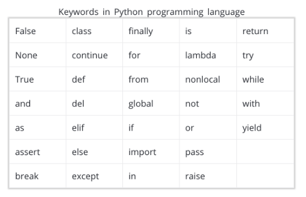

* Note that this code uses scientific notation to define large numbers. `4.445e8` is equal to `4.445 * 10 ** 8` which is equal to `444500000.0`.

#### Integers and Floats

* Because the float, or approximation, for 0.1 is actually slightly more than 0.1, when we add several of them together we can see the difference between the mathematically correct answer and the one that Python creates.

    * ```python
        >>> print(.1 + .1 + .1 == .3)
        False
        ```

### Lesson 3: Data Structures

#### Slicing a list

* You saw that we can pull more than one value from a list at a time by using slicing. When using slicing, it is important to remember that the `lower` index is `inclusive` and the `upper` index is `exclusive`.

* ```python
    >>> list_of_random_things = [1, 3.4, 'a string', True]
    >>> list_of_random_things[1:2]
    [3.4]
    ```

* will only return 3.4 in a list. Notice this is still different than just indexing a single element, because you get a list back with this indexing. The colon tells us to go from the starting value on the left of the colon up to, but not including, the element on the right.

* If you know that you want to start at the beginning, of the list you can also leave out this value.
    * ```python
        >>> list_of_random_things[:2]
        [1, 3.4]
        ```

* or to return all of the elements to the end of the list, we can leave off a final element.
    * ```python
        >>> list_of_random_things[1:]
        [3.4, 'a string', True]
        ```

#### Mutability and Order

* Mutability is about whether or not we can change an object once it has been created. If an object (like a list or string) can be changed (like a list can), then it is called mutable. However, if an object cannot be changed with creating a completely new object (like strings), then the object is considered immutable.

    * List is mutable and ordered
    * Tuple is immutable and ordered
        * ```(1,2,3,4)```
    * Set is mutable and has no duplicates
    * Dictionary for mutable objects that store mapping of unique keys to values.

* The == operator compares by checking for equality: If these cats were Python objects and we’d compare them with the == operator, we’d get “both cats are equal” as an answer.

* The is operator, however, compares identities: If we compared our cats with the is operator, we’d get “these are two different cats” as an answer.

### Lesson 4: Control Flow

* Zip: 
    * 
    * ```python
        letters = ['a', 'b', 'c']
        nums = [1, 2, 3]

        for letter, num in zip(letters, nums):
            print("{}: {}".format(letter, num))
        ```
    * In addition to zipping two lists together, you can also unzip a list into tuples using an asterisk.
        * ```python
            some_list = [('a', 1), ('b', 2), ('c', 3)]
            letters, nums = zip(*some_list)
            ```
        * ```python
            x_coord = [23, 53, 2, -12, 95, 103, 14, -5]
            y_coord = [677, 233, 405, 433, 905, 376, 432, 445]
            z_coord = [4, 16, -6, -42, 3, -6, 23, -1]
            labels = ["F", "J", "A", "Q", "Y", "B", "W", "X"]

            points = []
            for point in zip(labels, x_coord, y_coord, z_coord):
                points.append("{}: {}, {}, {}".format(*point))

            for point in points:
                print(point)
            ```

* Enumerate
    * 
    * enumerate is a built in function that returns an iterator of tuples containing indices and values of a list. You'll often use this when you want the index along with each element of an iterable in a loop.
        * ```python
            letters = ['a', 'b', 'c', 'd', 'e']
            for i, letter in enumerate(letters):
                print(i, letter)
            ```

* List Comprehensions
    * 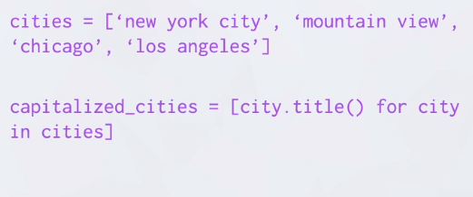 
    * ```python
        squares = [x**2 for x in range(9) if x % 2 == 0]
        squares = [x**2 for x in range(9) if x % 2 == 0 else x + 3]
        squares = [x**2 if x % 2 == 0 else x + 3 for x in range(9)]

        names = ["Rick Sanchez", "Morty Smith", "Summer Smith", "Jerry Smith", "Beth Smith"]

        first_names = [name.split(" ")[0].lower() for name in names]# write your list comprehension here
        print(first_names)
        ```

### Lesson 5: Functions

* Lambda Expressions

    * You can use lambda expressions to create anonymous functions. That is, functions that don’t have a name. They are helpful for creating quick functions that aren’t needed later in your code. This can be especially useful for higher order functions, or functions that take in other functions as arguments.

    *  
    * `double = lambda x: x * 2`

* Iterator: An object that represents a stream of data
    * The `yield` key-works is what differentiate a normal object from an iterator object
* Generator: A function that creates an iterator
    * Generators are a lazy way to build iterables. They are useful when the fully realized list would not fit in memory, or when the cost to calculate each list element is high and you want to do it as late as possible. But they can only be iterated over once.

```python
def my_enumerate(iterable, start=0):
    count = start
    for element in iterable:
        yield count, element
        count += 1

for i, lesson in my_enumerate(lessons, 1):
    print("Lesson {}: {}".format(i, lesson))

def chunker(iterable, size):
    """Yield successive chunks from iterable of length size."""
    for i in range(0, len(iterable), size):
        yield iterable[i:i + size]

for chunk in chunker(range(25), 4):
    print(list(chunk))

sq_list = [x**2 for x in range(10)]  # this produces a list of squares

sq_iterator = (x**2 for x in range(10))  # this produces an iterator of squares
```

### Lesson 6: Scripting

* ```python
    names = input("Enter names separated by commas: ").title().split(",")
    assignments = input("Enter assignment counts separated by commas: ").split(",")
    grades = input("Enter grades separated by commas: ").split(",")

    message = "Hi {},\n\nThis is a reminder that you have {} assignments left to \
    submit before you can graduate. You're current grade is {} and can increase \
    to {} if you submit all assignments before the due date.\n\n"

    for name, assignment, grade in zip(names, assignments, grades):
        print(message.format(name, assignment, grade, int(grade) + int(assignment)*2))
    ```

* ```python
    import useful_functions
    useful_functions.add_five([1, 2, 3, 4])

    import useful_functions as uf
    uf.add_five([1, 2, 3, 4])
    ```

* Using a main block

    * To avoid running executable statements in a script when it's imported as a module in another script, include these lines in an if __name__ == "__main__" block. Or alternatively, include them in a function called main() and call this in the if main block.

    * Whenever we run a script like this, Python actually sets a special built-in variable called __name__ for any module. When we run a script, Python recognizes this module as the main program, and sets the __name__ variable for this module to the string "__main__". For any modules that are imported in this script, this built-in __name__ variable is just set to the name of that module. Therefore, the condition if __name__ == "__main__"is just checking whether this module is the main program.

    * Try running `demo.py`

* Techniques for Importing Modules

    * There are other variants of import statements that are useful in different situations.

        * `from module_name import object_name`

        * `from module_name import first_object, second_object`

        * `import module_name as new_name`

        * `from module_name import object_name as new_name`

        * `from module_name import *`
            * **Do not do this**

* Exceptions
    * ```python
        try:
            # some code
        except ZeroDivisionError as e:
        # some code
        print("ZeroDivisionError occurred: {}".format(e))
        ```

### Lesson 7: Intro to Object-Oriented Programming

* ```python
    class Shirt:

    def __init__(self, shirt_color, shirt_size, shirt_style, shirt_price):
        self._price = shirt_price

    def get_price(self):
      return self._price

    def set_price(self, new_price):
      self._price = new_price


    shirt_one = Shirt('yellow', 'M', 'long-sleeve', 15)
    print(shirt_one.get_price())
    shirt_one.set_price(10)
    ```

*  A docstring is a type of comment that describes how a Python module, function, class or method works. Docstrings, therefore, are not unique to object-oriented programming. This section of the course is merely reminding you to use docstrings and to comment your code. It's not just going to help you understand and maintain your code. It will also make you a better job candidate.

* ```python
    class Pants:
    """The Pants class represents an article of clothing sold in a store
    """

    def __init__(self, color, waist_size, length, price):
        """Method for initializing a Pants object

        Args: 
            color (str)
            waist_size (int)
            length (int)
            price (float)

        Attributes:
            color (str): color of a pants object
            waist_size (str): waist size of a pants object
            length (str): length of a pants object
            price (float): price of a pants object
        """

        self.color = color
        self.waist_size = waist_size
        self.length = length
        self.price = price

    def change_price(self, new_price):
        """The change_price method changes the price attribute of a pants object

        Args: 
            new_price (float): the new price of the pants object

        Returns: None

        """
        self.price = new_price

    def discount(self, percentage):
        """The discount method outputs a discounted price of a pants object

        Args:
            percentage (float): a decimal representing the amount to discount

        Returns:
            float: the discounted price
        """
        return self.price * (1 - percentage)
    ```

* Magic methods 
    * `__init__` is one
    * `__add__` and `__repr__` are also examples
    * Those methods let you override and customize default Python behavior
        * `__add__` overrides the behavior of the plus sign
        * `__repr__` when the only code in a line is a variable

### Extra material

* **First-Class Objects**
In Python, functions are first-class objects. This means that functions can be passed around and used as arguments, just like any other object (string, int, float, list, and so on). Consider the following three functions:

* ```python
    def say_hello(name):
        return f"Hello {name}"

    def be_awesome(name):
        return f"Yo {name}, together we are the awesomest!"

    def greet_bob(greeter_func):
        return greeter_func("Bob")
    ```

* **Inner Functions** It’s possible to define functions inside other functions. Such functions are called inner functions. Here’s an example of a function with two inner functions:

* ```python
    def parent():
        print("Printing from the parent() function")

        def first_child():
            print("Printing from the first_child() function")

        def second_child():
            print("Printing from the second_child() function")

        second_child()
        first_child()
    ```

    * Furthermore, the inner functions are not defined until the parent function is called. They are locally scoped to parent(): they only exist inside the parent() function as local variables. Try calling first_child(). You should get an error

* **Simple Decorators** Now that you’ve seen that functions are just like any other object in Python, you’re ready to move on and see the magical beast that is the Python decorator. Let’s start with an example:

* ```python
    def my_decorator(func):
        def wrapper():
            print("Something is happening before the function is called.")
            func()
            print("Something is happening after the function is called.")
        return wrapper

    def say_whee():
        print("Whee!")

    say_whee = my_decorator(say_whee)
    ```

* ```python
    >>> say_whee()
    Something is happening before the function is called.
    Whee!
    Something is happening after the function is called.
    ```
* Put simply: decorators wrap a function, modifying its behavior.

 * Syntactic Sugar!
    * The way you decorated say_whee() above is a little clunky. First of all, you end up typing the name say_whee three times. In addition, the decoration gets a bit hidden away below the definition of the function.
    * Instead, Python allows you to use decorators in a simpler way with the @ symbol, sometimes called the “pie” syntax. The following example does the exact same thing as the first decorator example:

* ```python
    def my_decorator(func):
        def wrapper():
            print("Something is happening before the function is called.")
            func()
            print("Something is happening after the function is called.")
        return wrapper

    @my_decorator
    def say_whee():
        print("Whee!")
    ```

    * Recall that a decorator is just a regular Python function. All the usual tools for easy reusability are available. Let’s move the decorator to its own module that can be used in many other functions.

* **Decorating Functions With Arguments** 

    * ```python
            from decorators import do_twice

            @do_twice
            def greet(name):
                print(f"Hello {name}")
        ```

    * ```python
        def do_twice(func):
        def wrapper_do_twice(*args, **kwargs):
            print(args)
            print(kwargs)
            func(*args, **kwargs)
            func(*args, **kwargs)
        return wrapper_do_twice
        ```

    * There are 2 kinds of arguments in Python, one is positional arguments and other is keyword arguments, the former are specified according to their position and latter are the arguments with keyword which is the name of the argument.   

    * Before looking at the variadic positional/keyword arguments, we’ll talk about the positional arguments and keyword arguments simply.

    * ```python
        # A function that shows the results of running competitions consisting of 2 to 4 runners.
        def save_ranking(first, second, third=None, fourth=None):
            rank = {}
            rank[1], rank[2] = first, second
            rank[3] = third if third is not None else 'Nobody'
            rank[4] = fourth if fourth is not None else 'Nobody'
            print(rank)    

        # Pass the 2 positional arguments
        save_ranking('ming', 'alice')
        # Pass the 2 positional arguments and 1 keyword argument
        save_ranking('alice', 'ming', third='mike')
        # Pass the 2 positional arguments and 2 keyword arguments (But, one of them was passed as like positional argument)
        save_ranking('alice', 'ming', 'mike', fourth='jim')

        ```
    
    * Above function has 2 positional arguments: first, second and 2 keyword arguments: third, fourth. For positional arguments, it is not possible to omit it, and you must pass all positional arguments to the correct location for each number of arguments declared. However, for keyword arguments, you can set a default value of it when declaring a function, and if you omit the argument, the corresponding default value is entered as the value of the argument. That is, the keyword arguments can be omitted.

    * ```python
        def save_ranking(*args, **kwargs):
            print(args)     
            print(kwargs)
        save_ranking('ming', 'alice', 'tom', fourth='wilson', fifth='roy')     # ('ming', 'alice', 'tom')
        # {'fourth': 'wilson', 'fifth': 'roy'}
        ```
    
    * As you can see above, we are passing the arguments which can hold arbitrary numbers of positional or keyword values. The arguments passed as positional are stored in a list called args, and the arguments passed as keyword are stored in a dict called kwargs.

    * ```python
        from functools import reduce

        primes = [2, 3, 5, 7, 11, 13]

        def product(*numbers):
            p = reduce(lambda x, y: x * y, numbers)
            return p 

        product(*primes)
        # 30030

        product(primes)
        # [2, 3, 5, 7, 11, 13]
        ```

    * **For tuple, it could be done exactly same to list, and for dict, just use ** instead of *.**


## Numpy, Pandas, Matplotlib

### Anaconda

* Install Anaconda
    * `conda upgrade conda`
    * `conda upgrade --all`

* Anaconda is an open source distribution for Python designed for large-scale data. With Anaconda you will be able to simplify package management.

* Welcome to this lesson on using Anaconda to manage packages and environments for use with Python. With Anaconda, it's simple to install the packages you'll often use in data science work. You'll also use it to create virtual environments that make working on multiple projects much less mind-twisting. Anaconda has simplified my workflow and solved a lot of issues I had dealing with packages and multiple Python versions.

* Anaconda is actually a distribution of software that comes with conda, Python, and over 150 scientific packages and their dependencies. The application conda is a package and environment manager. Anaconda is a fairly large download (~500 MB) because it comes with the most common data science packages in Python. If you don't need all the packages or need to conserve bandwidth or storage space, there is also Miniconda, a smaller distribution that includes only conda and Python. Miniconda can do everything Anaconda does, but doesn't have the preinstalled packages. You can still install any of the available packages with conda, it just doesn't come with them, so either Anaconda or Miniconda are fine for this course.

* Package managers are used to install libraries and other software on your computer. You’re probably already familiar with `pip`, it’s the default package manager for Python libraries. Conda is similar to pip except that the available packages are focused around data science while pip is for general use. However, conda is not Python specific like pip is, it can also install non-Python packages. It is a package manager for any software stack. That being said, not all Python libraries are available from the Anaconda distribution and conda. You can (and will) still use pip alongside conda to install packages.

* You can install multiple packages at the same time. Something like `conda install numpy scipy pandas` will install all those packages simultaneously. It's also possible to specify which version of a package you want by adding the version number such as `conda install numpy=1.10`.

* Most of the commands are pretty intuitive. To uninstall, use `conda remove package_name`. To update a package `conda update package_name`. If you want to update all packages in an environment, which is often useful, use `conda update --all`. And finally, to list installed packages, it's conda list which you've seen before.

### Managing Anaconda Environments 

* As I mentioned before, conda can be used to create environments to isolate your projects. To create an environment, use `conda create -n env_name list of packages` in your terminal. Here -n env_name sets the name of your environment (-n for name) and list of packages is the list of packages you want installed in the environment. For example, to create an environment named my_env and install numpy in it, type `conda create -n my_env numpy`.

* When creating an environment, you can specify which version of Python to install in the environment. This is useful when you're working with code in both Python 2.x and Python 3.x. To create an environment with a specific Python version, do something like `conda create -n py3 python=3` or `conda create -n py2 python=2`. I actually have both of these environments on my personal computer. I use them as general environments not tied to any specific project, but rather for general work with each Python version easily accessible. These commands will install the most recent version of Python 3 and 2, respectively. To install a specific version, use `conda create -n py python=3.3` for Python 3.3.

* `conda activate my_env` to enter it.

    * When you're in the environment, you'll see the environment name in the terminal prompt. Something like `(my_env) ~ $`. The environment has only a few packages installed by default, plus the ones you installed when creating it. You can check this out with `conda list`. Installing packages in the environment is the same as before: `conda install package_name`. Only this time, the specific packages you install will only be available when you're in the environment. To leave the environment, type `source deactivate` (on OSX/Linux). On Windows, use `deactivate`.

### Saving Environments 

* A really useful feature is sharing environments so others can install all the packages used in your code, with the correct versions. You can save the packages to a YAML file with `conda env export > environment.yaml`. The first part `conda env` export writes out all the packages in the environment, including the Python version.

* To create an environment from an environment file use `conda env create -f environment.yaml`. This will create a new environment with the same name listed in environment.yaml.

* **Listing environments**

    * If you forget what your environments are named (happens to me sometimes), use `conda env list` to list out all the environments you've created. You should see a list of environments, there will be an asterisk next to the environment you're currently in. The default environment, the environment used when you aren't in one, is called root.

* **Removing environments**

    * If there are environments you don't use anymore, `conda env remove -n env_name` will remove the specified environment (here, named env_name).

## Best practices - Environments 

* One thing that’s helped me tremendously is having separate environments for Python 2 and Python 3. I used `conda create -n py2 python=2` and `conda create -n py3 python=3` to create two separate environments, py2 and py3. Now I have a general use environment for each Python version. In each of those environments, I've installed most of the standard data science packages (numpy, scipy, pandas, etc.). Remember that when you set up an environment initially, you'll only start with the standard packages and whatever packages you specify in your conda create statement.

* I’ve also found it useful to create environments for each project I’m working on. It works great for non-data related projects too like web apps with Flask. For example, I have an environment for my personal blog using Pelican.

* **Sharing Environments**

    * When sharing your code on GitHub, it's good practice to make an environment file and include it in the repository. This will make it easier for people to install all the dependencies for your code. I also usually include a pip `requirements.txt` file using `pip freeze` (learn more here) for people not using conda.

### Jupyter notebooks

* Welcome to this lesson on using Jupyter notebooks. The notebook is a web application that allows you to combine explanatory text, math equations, code, and visualizations all in one easily sharable document.

* Notebooks have quickly become an essential tool when working with data. You'll find them being used for data cleaning and exploration, visualization, machine learning, and big data analysis.

* Notebooks are a form of literate programming proposed by Donald Knuth in 1984. With literate programming, the documentation is written as a narrative alongside the code instead of sitting off by its own. In Donald Knuth's words:
    * Instead of imagining that our main task is to instruct a computer what to do, let us concentrate rather on explaining to human beings what we want a computer to do.

* Just a small aside: recently, this idea of literate programming has been extended to a whole programming language, Eve.

* **How notebooks work**

    * Jupyter notebooks grew out of the IPython project started by Fernando Perez. IPython is an interactive shell, similar to the normal Python shell but with great features like syntax highlighting and code completion. Originally, notebooks worked by sending messages from the web app (the notebook you see in the browser) to an IPython kernel (an IPython application running in the background). The kernel executed the code, then sent it back to the notebook. The current architecture is similar, drawn out below.

    * 

    * The central point is the notebook server. You connect to the server through your browser and the notebook is rendered as a web app. Code you write in the web app is sent through the server to the kernel. The kernel runs the code and sends it back to the server, then any output is rendered back in the browser. When you save the notebook, it is written to the server as a JSON file with a .ipynb file extension.

    * The great part of this architecture is that the kernel doesn't need to run Python. Since the notebook and the kernel are separate, code in any language can be sent between them. For example, two of the earlier non-Python kernels were for the R and Julia languages. With an R kernel, code written in R will be sent to the R kernel where it is executed, exactly the same as Python code running on a Python kernel. IPython notebooks were renamed because notebooks became language agnostic. The new name Jupyter comes from the combination of Julia, Python, and R. If you're interested, here's a list of available kernels.

    * Another benefit is that the server can be run anywhere and accessed via the internet. Typically you'll be running the server on your own machine where all your data and notebook files are stored. But, you could also set up a server on a remote machine or cloud instance like Amazon's EC2. Then, you can access the notebooks in your browser from anywhere in the world.

    * By far the easiest way to install Jupyter is with Anaconda. Jupyter notebooks automatically come with the distribution. You'll be able to use notebooks from the default environment.

    * Local install: `conda install jupyter notebook`

    * To start a Jupyter notebook just run: `jupyter notebook`

    * You should consider installing Notebook Conda to help manage your environments. Run the following command:

        * `conda install nb_conda`
        * 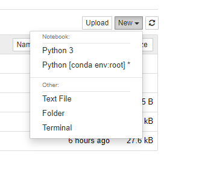
    
    * You can shutdown the entire server by pressing control + C twice in the terminal. Again, this will immediately shutdown all the running notebooks, so make sure your work is saved!

* **Notebook Interface**

    * You’ll see a little box outlined in green. This is called a cell. Cells are where you write and run your code. You can also change it to render Markdown, a popular formatting syntax for writing web content. I'll cover Markdown in more detail later. In the toolbar, click “Code” to change it to Markdown and back. The little play button runs the cell, and the up and down arrows move cells up and down.

    * In the "File" menu, you can download the notebook in multiple formats. You'll often want to download it as an HTML file to share with others who aren't using Jupyter. Also, you can download the notebook as a normal Python file where all the code will run like normal. The Markdown and reST formats are great for using notebooks in blogs or documentation.

    * You can create math expressions in Markdown cells using LaTeX symbols. Notebooks use MathJax to render the LaTeX symbols as math symbols. To start math mode, wrap the LaTeX in dollar signs $y = mx + b$ for inline math. For a math block, use double dollar signs,

        * ```
            $$
            y = \frac{a}{b+c}
            $$
            ```

* **Magic keywords**

    * Magic keywords are special commands you can run in cells that let you control the notebook itself or perform system calls such as changing directories. For example, you can set up matplotlib to work interactively in the notebook with `%matplotlib`.

    * Magic commands are preceded with one or two percent signs (% or %%) for **line magics and cell magics, respectively. Line magics apply only to the line the magic command is written on, while cell magics apply to the whole cell.**

    * **NOTE**: These magic keywords are specific to the normal Python kernel. If you are using other kernels, these most likely won't work.

    * At some point, you'll probably spend some effort optimizing code to run faster. Timing how quickly your code runs is essential for this optimization. You can use the `timeit` magic command to time how long it takes for a function to run, like so:

        * 
    
    * If you want to time how long it takes for a whole cell to run, you’d use `%%timeit` like so:

        * 

* **Embedding visualizations in notebooks**

    * As mentioned before, notebooks let you embed images along with text and code. This is most useful when you’re using `matplotlib` or other plotting packages to create visualizations. You can use `%matplotlib` to set up matplotlib for interactive use in the notebook. By default figures will render in their own window. However, you can pass arguments to the command to select a specific "backend", the software that renders the image. To render figures directly in the notebook, you should use the inline backend with the command `%matplotlib inline`.

    * 

* **Debugging in the Notebook**

    * With the Python kernel, you can turn on the interactive debugger using the magic command `%pdb`. When you cause an error, you'll be able to inspect the variables in the current namespace.

        *  

* **Converting notebooks**

    * Notebooks are just big JSON files with the extension `.ipynb`.

    * Since notebooks are JSON, it is simple to convert them to other formats. Jupyter comes with a utility called `nbconvert` for converting to HTML, Markdown, slideshows, etc.

    * For example, to convert a notebook to an HTML file, in your terminal use    

        * `jupyter nbconvert --to html notebook.ipynb`
    
    * Converting to HTML is useful for sharing your notebooks with others who aren't using notebooks. Markdown is great for including a notebook in blogs and other text editors that accept Markdown formatting.

    * Create slideshows from notebooks is one of my favorite features. The slides are created in notebooks like normal, but you'll need to designate which cells are slides and the type of slide the cell will be. In the menu bar, click View > Cell Toolbar > Slideshow to bring up the slide cell menu on each cell.

    * Running the slideshow

        * To create the slideshow from the notebook file, you'll need to use `nbconvert`:

            * `jupyter nbconvert notebook.ipynb --to slides`
        
        * This just converts the notebook to the necessary files for the slideshow, but you need to serve it with an HTTP server to actually see the presentation.

        * To convert it and immediately see it, use

            * `jupyter nbconvert notebook.ipynb --to slides --post serve`
        
        * This will open up the slideshow in your browser so you can present it.

### NumPy

* NumPy stands for Numerical Python and it is a fundamental package for scientific computing in Python. NumPy provides Python with an extensive math library capable of performing numerical computations **effectively and efficiently**. These lessons are intended as a basic overview of NumPy and introduces some of its most important features.

    * NumPy is written in C and Fortran

    * NumPy is included with Anaconda. If you don't already have Anaconda installed on your computer, please refer to the Anaconda section to get clear instructions on how to install Anaconda on your PC or Mac.

*  The following lessons were created using NumPy version 1.13.0. You can check which version of NumPy you have by typing !conda list numpy in your Jupyter Notebook or by typing `conda list numpy` in the Anaconda prompt.  If you have another version of NumPy installed in your computer, you can update your version by typing `conda install numpy=1.13` in the Anaconda prompt.

* NumPy is an order of magnitude faster compared to normal python arrays, check Jupyter notebook `NumPy.ipynb`

    * Even though Python lists are great on their own, NumPy has a number of key features that give it great advantages over Python lists. One such feature is speed. When performing operations on large arrays NumPy can often perform several orders of magnitude faster than Python lists. This speed comes from the nature of NumPy arrays being memory-efficient and from optimized algorithms used by NumPy for doing arithmetic, statistical, and linear algebra operations.

    * Another great feature of NumPy is that it has multidimensional array data structures that can represent vectors and matrices. You will learn all about vectors and matrices in the Linear Algebra section of this course later on, and as you will soon see, a lot of machine learning algorithms rely on matrix operations. For example, when training a Neural Network, you often have to carry out many matrix multiplications. NumPy is optimized for matrix operations and it allows us to do Linear Algebra operations effectively and efficiently, making it very suitable for solving machine learning problems.

    * Another great advantage of NumPy over Python lists is that NumPy has a large number of optimized built-in mathematical functions. These functions allow you to do a variety of complex mathematical computations very fast and with very little code (avoiding the use of complicated loops) making your programs more readable and easier to understand.

* Creating NumPy arrays (ndarrays -> n dimensional array)

    * Check `NumPy-2.ipynb`, `NumPy-3.ipynb`, etc for complete notes

    * NumPy handles more data types than python 

    * At the core of NumPy is the ndarray, where nd stands for n-dimensional. An ndarray is a multidimensional array of elements all of the same type. In other words, an ndarray is a grid that can take on many shapes and can hold either numbers or strings. In many Machine Learning problems you will often find yourself using ndarrays in many different ways. For instance, you might use an ndarray to hold the pixel values of an image that will be fed into a Neural Network for image classification.

    * Let's pause for a second to introduce some useful terminology. We refer to 1D arrays as rank 1 arrays. In general N-Dimensional arrays have rank N. Therefore, we refer to a 2D array as a rank 2 array. Another important property of arrays is their shape. The shape of an array is the size along each of its dimensions. For example, the shape of a rank 2 array will correspond to the number of rows and columns of the array. As you will see, NumPy ndarrays have attributes that allow us to get information about them in a very intuitive way. For example, the shape of an ndarray can be obtained using the `.shape` attribute. The shape attribute returns a tuple of N positive integers that specify the sizes of each dimension. In the example below we will create a rank 1 array and learn how to obtain its shape, its type, and the data-type (dtype) of its elements.

    * We can see that the shape attribute returns the tuple `(5,)` telling us that x is of rank 1 (i.e. x only has 1 dimension ) and it has 5 elements. The `type()` function tells us that x is indeed a NumPy ndarray. Finally, the `.dtype` attribute tells us that the elements of x are stored in memory as signed 64-bit integers. Another great advantage of NumPy is that it can handle more data-types than Python lists. You can check out all the different data types NumPy supports in the link below:
        * https://docs.scipy.org/doc/numpy-1.13.0/user/basics.types.html

    * **It is important to remember that one big difference between Python lists and ndarrays, is that unlike Python lists, all the elements of an ndarray must be of the same type.**

    * For more details check course material and specially the `.ipynb` files
        * `8 - Mini Project - Mean Normalization and Data Separation` does a good coverage of NumPy in the real world

### Panda

* Pandas is a package for **data manipulation and analysis** in Python. The name Pandas is derived from the econometrics term Panel Data. Pandas incorporates two additional data structures into Python, namely Pandas Series and Pandas DataFrame. These data structures allow us to work with labeled and relational data in an easy and intuitive manner. These lessons are intended as a basic overview of Pandas and introduces some of its most important features.

    * `conda list pandas` -> version 0.24

* **Why use Panda?**
    * The recent success of machine learning algorithms is partly due to the huge amounts of data that we have available to train our algorithms on. However, when it comes to data, quantity is not the only thing that matters, the quality of your data is just as important. It often happens that large datasets don’t come ready to be fed into your learning algorithms. More often than not, large datasets will often have missing values, outliers, incorrect values, etc… Having data with a lot of missing or bad values, for example, is not going to allow your machine learning algorithms to perform well. Therefore, one very important step in machine learning is to look at your data first and make sure it is well suited for your training algorithm by doing some basic data analysis. This is where Pandas comes in. **Pandas Series and DataFrames are designed for fast data analysis and manipulation**, as well as being flexible and easy to use. Below are just a few features that makes Pandas an excellent package for data analysis:

        * Allows the use of labels for rows and columns
        * Can calculate rolling statistics on time series data
        * Easy handling of NaN values
        * Is able to load data of different formats into DataFrames
        * Can join and merge different datasets together
        * It integrates with NumPy and Matplotlib
    
    * For these and other reasons, Pandas DataFrames have become one of the most commonly used Pandas object for data analysis in Python.

    * A Pandas series is a **one-dimensional array-like object that can hold many data types**, such as numbers or strings. One of the main differences between Pandas Series and NumPy ndarrays is that you can assign an **index label to each element in the Pandas Series**. In other words, you can **name the indices of your Pandas Series anything you want**. Another big difference between Pandas Series and NumPy ndarrays is that Pandas Series can hold data of different data types.

        * Let's start by importing Pandas into Python. It has become a convention to import Pandas as pd, therefore, you can import Pandas by typing the following command in your Jupyter notebook: 
            * `import pandas as pd`
        
        * Let's begin by creating a Pandas Series. You can create Pandas Series by using the command `pd.Series(data, index)`, where `index` is a list of index labels. Let's use a Pandas Series to store a grocery list. We will use the food items as index labels and the quantity we need to buy of each item as our data.

            * eggs           30
            * apples         6
            * milk         Yes
            * bread       No
            * dtype: object

        * We see that Pandas Series are displayed with the indices in the first column and the data in the second column. Notice that the data is not indexed 0 to 3 but rather it is indexed with the names of the food we put in, namely eggs, apples, etc... Also notice that the data in our Pandas Series has both integers and strings.

        * Just like NumPy ndarrays, Pandas Series have attributes that allows us to get information from the series in an easy way. Let's see some of them:

            * ```python
                # We print some information about Groceries
                print('Groceries has shape:', groceries.shape)
                print('Groceries has dimension:', groceries.ndim)
                print('Groceries has a total of', groceries.size, 'elements')
                ```
        
        * We can also print the index labels and the data of the Pandas Series separately. This is useful if you don't happen to know what the index labels of the Pandas Series are.

            * ```python
                # We print the index and data of Groceries
                print('The data in Groceries is:', groceries.values)
                print('The index of Groceries is:', groceries.index)
                ```
        
        * If you are dealing with a very large Pandas Series and if you are not sure whether an index label exists, you can check by using the in command

            * ```python
                # We check whether bananas is a food item (an index) in Groceries
                x = 'bananas' in groceries

                # We check whether bread is a food item (an index) in Groceries
                y = 'bread' in groceries

                # We print the results
                print('Is bananas an index label in Groceries:', x)
                print('Is bread an index label in Groceries:', y)
                ```
        
        * Now let's look at how we can access or modify elements in a Pandas Series. One great advantage of Pandas Series is that it allows us to access data in many different ways. Elements can be accessed using index labels or numerical indices inside square brackets, [ ], similar to how we access elements in NumPy ndarrays. Since we can use numerical indices, we can use both positive and negative integers to access data from the beginning or from the end of the Series, respectively. Since we can access elements in various ways, in order to remove any ambiguity to whether we are referring to an index label or numerical index, Pandas Series have two attributes, `.loc` and `.iloc` to explicitly state what we mean. The attribute `.loc` stands for **location** and it is used to explicitly state that we are using a labeled index. Similarly, the attribute `.iloc` stands for **integer location** and it is used to explicitly state that we are using a numerical index. Let's see some examples:

            * ```python
                # We access elements in Groceries using index labels:

                # We use a single index label
                print('How many eggs do we need to buy:', groceries['eggs'])
                print()

                # we can access multiple index labels
                print('Do we need milk and bread:\n', groceries[['milk', 'bread']]) 
                print()

                # we use loc to access multiple index labels
                print('How many eggs and apples do we need to buy:\n', groceries.loc[['eggs', 'apples']]) 
                print()

                # We access elements in Groceries using numerical indices:

                # we use multiple numerical indices
                print('How many eggs and apples do we need to buy:\n',  groceries[[0, 1]]) 
                print()

                # We use a negative numerical index
                print('Do we need bread:\n', groceries[[-1]]) 
                print()

                # We use a single numerical index
                print('How many eggs do we need to buy:', groceries[0]) 
                print()
                # we use iloc to access multiple numerical indices
                print('Do we need milk and bread:\n', groceries.iloc[[2, 3]]) 
                ```
        
        * Pandas Series are also mutable like NumPy ndarrays, which means we can change the elements of a Pandas Series after it has been created. For example, let's change the number of eggs we need to buy from our grocery list

            * ```python
                # We display the original grocery list
                print('Original Grocery List:\n', groceries)

                # We change the number of eggs to 2
                groceries['eggs'] = 2

                # We display the changed grocery list
                print()
                print('Modified Grocery List:\n', groceries)
                ```
        
        * We can also delete items from a Pandas Series by using the `.drop()` method. The `Series.drop(label)` method removes the given `label` from the given Series. We should note that the `Series.drop(label)` method drops elements from the Series out of place, meaning that **it doesn't change the original Series being modified**. Let's see how this works:

            * ```python
                # We display the original grocery list
                print('Original Grocery List:\n', groceries)

                # We remove apples from our grocery list. The drop function removes elements out of place
                print()
                print('We remove apples (out of place):\n', groceries.drop('apples'))

                # When we remove elements out of place the original Series remains intact. To see this
                # we display our grocery list again
                print()
                print('Grocery List after removing apples out of place:\n', groceries)
                ```
        
        * We can delete items from a Pandas Series in place by setting the keyword `inplace` to `True` in the `.drop()` method. Let's see an example:

            * ```python
                # We display the original grocery list
                print('Original Grocery List:\n', groceries)

                # We remove apples from our grocery list in place by setting the inplace keyword to True
                groceries.drop('apples', inplace = True)

                # When we remove elements in place the original Series its modified. To see this
                # we display our grocery list again
                print()
                print('Grocery List after removing apples in place:\n', groceries)
                ```
        
        * Just like with NumPy ndarrays, we can perform element-wise arithmetic operations on Pandas Series. In this lesson we will look at arithmetic operations between **Pandas Series** and single numbers. Let's create a new Pandas Series that will hold a grocery list of just fruits.


            * ```python
                # We create a Pandas Series that stores a grocery list of just fruits
                fruits= pd.Series(data = [10, 6, 3,], index = ['apples', 'oranges', 'bananas'])

                # We display the fruits Pandas Series
                print(fruits)
                ```
        
        * We can now modify the data in fruits by performing basic arithmetic operations. Let's see some examples

            * ```python
                # We print fruits for reference
                print('Original grocery list of fruits:\n ', fruits)

                # We perform basic element-wise operations using arithmetic symbols
                print()
                print('fruits + 2:\n', fruits + 2) # We add 2 to each item in fruits
                print()
                print('fruits - 2:\n', fruits - 2) # We subtract 2 to each item in fruits
                print()
                print('fruits * 2:\n', fruits * 2) # We multiply each item in fruits by 2 
                print()
                print('fruits / 2:\n', fruits / 2) # We divide each item in fruits by 2
                print()
                ```
        
        * You can also apply mathematical functions from NumPy, such assqrt(x), to all elements of a Pandas Series.

            * ```python
                # We import NumPy as np to be able to use the mathematical functions
                import numpy as np

                # We print fruits for reference
                print('Original grocery list of fruits:\n', fruits)

                # We apply different mathematical functions to all elements of fruits
                print()
                print('EXP(X) = \n', np.exp(fruits))
                print() 
                print('SQRT(X) =\n', np.sqrt(fruits))
                print()
                print('POW(X,2) =\n',np.power(fruits,2)) # We raise all elements of fruits to the power of 2
                ```
        
        * Pandas also allows us to only apply arithmetic operations on selected items in our fruits grocery list. Let's see some examples

            * ```python
                # We print fruits for reference
                print('Original grocery list of fruits:\n ', fruits)
                print()

                # We add 2 only to the bananas
                print('Amount of bananas + 2 = ', fruits['bananas'] + 2)
                print()

                # We subtract 2 from apples
                print('Amount of apples - 2 = ', fruits.iloc[0] - 2)
                print()

                # We multiply apples and oranges by 2
                print('We double the amount of apples and oranges:\n', fruits[['apples', 'oranges']] * 2)
                print()

                # We divide apples and oranges by 2
                print('We half the amount of apples and oranges:\n', fruits.loc[['apples', 'oranges']] / 2)
                ```
        
        * You can also apply arithmetic operations on Pandas Series of mixed data type provided that the arithmetic operation is defined for all data types in the Series, otherwise you will get an error. Let's see what happens when we multiply our grocery list by 2

            * ```python
                # We multiply our grocery list by 2
                groceries * 2
                ```
        
        * As we can see, in this case, since we multiplied by 2, Pandas doubles the data of each item including the strings. Pandas can do this because the multiplication operation * is defined both for numbers and strings. If you were to apply an operation that was valid for numbers but not strings, say for instance, / you will get an error. So when you have mixed data types in your Pandas Series make sure the arithmetic operations are valid on all the data types of your elements.

        * ```python
            import pandas as pd

            # Create a Pandas Series that contains the distance of some planets from the Sun.
            # Use the name of the planets as the index to your Pandas Series, and the distance
            # from the Sun as your data. The distance from the Sun is in units of 10^6 km

            distance_from_sun = [149.6, 1433.5, 227.9, 108.2, 778.6]

            planets = ['Earth','Saturn', 'Mars','Venus', 'Jupiter']

            # Create a Pandas Series using the above data, with the name of the planets as
            # the index and the distance from the Sun as your data.
            dist_planets = pd.Series(data = distance_from_sun, index = planets)

            # Calculate the number of minutes it takes sunlight to reach each planet. You can
            # do this by dividing the distance from the Sun for each planet by the speed of light.
            # Since in the data above the distance from the Sun is in units of 10^6 km, you can
            # use a value for the speed of light of c = 18, since light travels 18 x 10^6 km/minute.
            time_light = dist_planets / 18

            # Use Boolean indexing to select only those planets for which sunlight takes less
            # than 40 minutes to reach them.
            close_planets = dist_planets[time_light< 40]
            ```
    
    * **Pandas DataFrames** are two-dimensional data structures with labeled rows and columns, that can hold many data types. If you are familiar with Excel, you can think of Pandas DataFrames as being similar to a spreadsheet. We can create Pandas DataFrames manually or by loading data from a file. In these lessons we will start by learning how to create Pandas DataFrames manually from dictionaries and later we will see how we can load data into a DataFrame from a data file.

    * We will start by creating a DataFrame manually from a dictionary of Pandas Series. In this case the first step is to create the dictionary of Pandas Series. After the dictionary is created we can then pass the dictionary to the `pd.DataFrame()` function.

    * We will create a dictionary that contains items purchased by two people, Alice and Bob, on an online store. The Pandas Series will use the price of the items purchased as data, and the purchased items will be used as the index labels to the Pandas Series. Let's see how this done in code:

        * ```python
            # We import Pandas as pd into Python
            import pandas as pd

            # We create a dictionary of Pandas Series 
            items = {'Bob' : pd.Series(data = [245, 25, 55], index = ['bike', 'pants', 'watch']),
                    'Alice' : pd.Series(data = [40, 110, 500, 45], index = ['book', 'glasses', 'bike', 'pants'])}

            # We print the type of items to see that it is a dictionary
            print(type(items))
            ```
        
        * 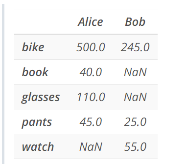
    
    * Now that we have a dictionary, we are ready to create a DataFrame by passing it to the `pd.DataFrame()` function. We will create a DataFrame that could represent the shopping carts of various users, in this case we have only two users, Alice and Bob.

        * There are several things to notice here that are worth pointing out. We see that DataFrames are displayed in tabular form, much like an Excel spreadsheet, with the labels of rows and columns in bold. Also notice that the row labels of the DataFrame are built from the union of the index labels of the two Pandas Series we used to construct the dictionary. And the column labels of the DataFrame are taken from the keys of the dictionary. Another thing to notice is that the columns are arranged alphabetically and not in the order given in the dictionary. We will see later that this won't happen when we load data into a DataFrame from a data file. The last thing we want to point out is that we see some NaN values appear in the DataFrame. NaN stands for Not a Number, and is Pandas way of indicating that it doesn't have a value for that particular row and column index. For example, if we look at the column of Alice, we see that it has NaN in the watch index. You can see why this is the case by looking at the dictionary we created at the beginning. We clearly see that the dictionary has no item for Alice labeled watches. So whenever a DataFrame is created, if a particular column doesn't have values for a particular row index, Pandas will put a NaN value there. If we were to feed this data into a machine learning algorithm we will have to remove these NaN values first. In a later lesson we will learn how to deal with NaN values and clean our data. For now, we will leave these values in our DataFrame.

        * In the above example we created a Pandas DataFrame from a dictionary of Pandas Series that had clearly defined indexes. If we don't provide index labels to the Pandas Series, Pandas will use numerical row indexes when it creates the DataFrame. Let's see an example:

        * ```python
            # We create a dictionary of Pandas Series without indexes
            data = {'Bob' : pd.Series([245, 25, 55]),
                    'Alice' : pd.Series([40, 110, 500, 45])}

            # We create a DataFrame
            df = pd.DataFrame(data)

            # We display the DataFrame
            df
            ```
        
        * We can see that Pandas indexes the rows of the DataFrame starting from 0, just like NumPy indexes ndarrays.

        * Now, just like with Pandas Series we can also extract information from DataFrames using attributes. Let's print some information from our `shopping_carts` DataFrame

            * ```python
                # We print some information about shopping_carts
                print('shopping_carts has shape:', shopping_carts.shape)
                print('shopping_carts has dimension:', shopping_carts.ndim)
                print('shopping_carts has a total of:', shopping_carts.size, 'elements')
                print()
                print('The data in shopping_carts is:\n', shopping_carts.values)
                print()
                print('The row index in shopping_carts is:', shopping_carts.index)
                print()
                print('The column index in shopping_carts is:', shopping_carts.columns)
                ```

        * When creating the shopping_carts DataFrame we passed the entire dictionary to the `pd.DataFrame()` function. However, there might be cases when you are only interested in a subset of the data. Pandas allows us to select which data we want to put into our DataFrame by means of the keywords columns and index. Let's see some examples:

            * ```python
                # We Create a DataFrame that only has Bob's data
                bob_shopping_cart = pd.DataFrame(items, columns=['Bob'])

                # We display bob_shopping_cart
                bob_shopping_cart

                # We Create a DataFrame that only has selected items for both Alice and Bob
                sel_shopping_cart = pd.DataFrame(items, index = ['pants', 'book'])

                # We display sel_shopping_cart
                sel_shopping_cart

                # We Create a DataFrame that only has selected items for Alice
                alice_sel_shopping_cart = pd.DataFrame(items, index = ['glasses', 'bike'], columns = ['Alice'])

                # We display alice_sel_shopping_cart
                alice_sel_shopping_cart
                ```
        
        * You can also manually create DataFrames from a dictionary of lists (arrays). The procedure is the same as before, we start by creating the dictionary and then passing the dictionary to the `pd.DataFrame()` function. In this case, however, all the lists (arrays) in the dictionary must be of the same length. Let' see an example:

            * ```python
                # We create a dictionary of lists (arrays)
                data = {'Integers' : [1,2,3],
                        'Floats' : [4.5, 8.2, 9.6]}

                # We create a DataFrame 
                df = pd.DataFrame(data)

                # We display the DataFrame
                df
                ```
        
        * Notice that since the data dictionary we created doesn't have label indices, Pandas automatically uses numerical row indexes when it creates the DataFrame. We can however, put labels to the row index by using the index keyword in the `pd.DataFrame()` function. Let's see an example

            * ```python
                # We create a list of Python dictionaries
                items2 = [{'bikes': 20, 'pants': 30, 'watches': 35}, 
                        {'watches': 10, 'glasses': 50, 'bikes': 15, 'pants':5}]

                # We create a DataFrame 
                store_items = pd.DataFrame(items2)

                # We display the DataFrame
                store_items
                ```

            * 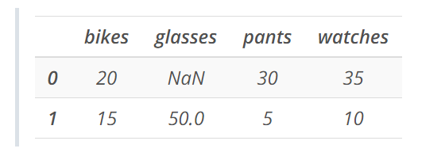
        
        * Again, notice that since the items2 dictionary we created doesn't have label indices, Pandas automatically uses numerical row indexes when it creates the DataFrame. As before, we can put labels to the row index by using the index keyword in the `pd.DataFrame()` function. Let's assume we are going to use this DataFrame to hold the number of items a particular store has in stock. So, we will label the row indices as store 1 and store 2.

            * 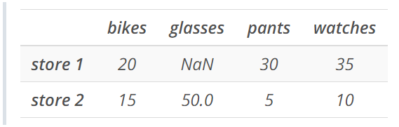
        
        * We can access elements in Pandas DataFrames in many different ways. In general, we can access rows, columns, or individual elements of the DataFrame by using the row and column labels. We will use the same `store_items` DataFrame created in the previous lesson. Let's see some examples:

            * ```python
                # We import Pandas as pd into Python
                import pandas as pd

                # We create a list of Python dictionaries
                items2 = [{'bikes': 20, 'pants': 30, 'watches': 35}, 
                        {'watches': 10, 'glasses': 50, 'bikes': 15, 'pants':5}]

                # We create a DataFrame  and provide the row index
                store_items = pd.DataFrame(items2, index = ['store 1', 'store 2'])

                # We print the store_items DataFrame
                print(store_items)

                # We access rows, columns and elements using labels
                print()
                print('How many bikes are in each store:\n', store_items[['bikes']])
                print()
                print('How many bikes and pants are in each store:\n', store_items[['bikes', 'pants']])
                print()
                print('What items are in Store 1:\n', store_items.loc[['store 1']])
                print()
                print('How many bikes are in Store 2:', store_items['bikes']['store 2'])
                ```
            
            * 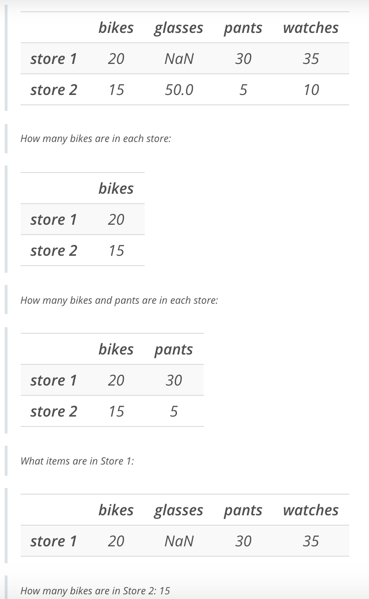
    
    * It is important to know that when accessing individual elements in a DataFrame, as we did in the last example above, the labels should always be provided with the column label first, i.e. in the form `dataframe[column][row]`. For example, when retrieving the number bikes in store 2, we first used the column label bikes and then the row label store 2. If you provide the row label first you will get an error.

    * We can also modify our DataFrames by adding rows or columns. Let's start by learning how to add new columns to our DataFrames. Let's suppose we decided to add shirts to the items we have in stock at each store. To do this, we will need to add a new column to our `store_items` DataFrame indicating how many shirts are in each store. Let's do that:

        * ```python
            # We add a new column named shirts to our store_items DataFrame indicating the number of
            # shirts in stock at each store. We will put 15 shirts in store 1 and 2 shirts in store 2
            store_items['shirts'] = [15,2]

            # We display the modified DataFrame
            store_items
            ```
    
    * Suppose now, that you opened a new store and you need to add the number of items in stock of that new store into your DataFrame. We can do this by adding a new row to the `store_items` Dataframe. To add rows to our DataFrame we first have to create a new Dataframe and then append it to the original DataFrame. Let's see how this works

        * ```python
            # We create a dictionary from a list of Python dictionaries that will number of items at the new store
            new_items = [{'bikes': 20, 'pants': 30, 'watches': 35, 'glasses': 4}]

            # We create new DataFrame with the new_items and provide and index labeled store 3
            new_store = pd.DataFrame(new_items, index = ['store 3'])

            # We display the items at the new store
            new_store

            # We append store 3 to our store_items DataFrame
            store_items = store_items.append(new_store, sort=False)

            # We display the modified DataFrame
            store_items
            ```
    
    * Notice that by appending a new row to the DataFrame, the columns have been put in alphabetical order.

    * We can also add new columns of our DataFrame by using only data from particular rows in particular columns. For example, suppose that you want to stock stores 2 and 3 with new watches and you want the quantity of the new watches to be the same as the watches already in stock for those stores. Let's see how we can do this

        * ```python
            # We add a new column using data from particular rows in the watches column
            store_items['new watches'] = store_items['watches'][1:]

            # We display the modified DataFrame
            store_items
            ```

        * 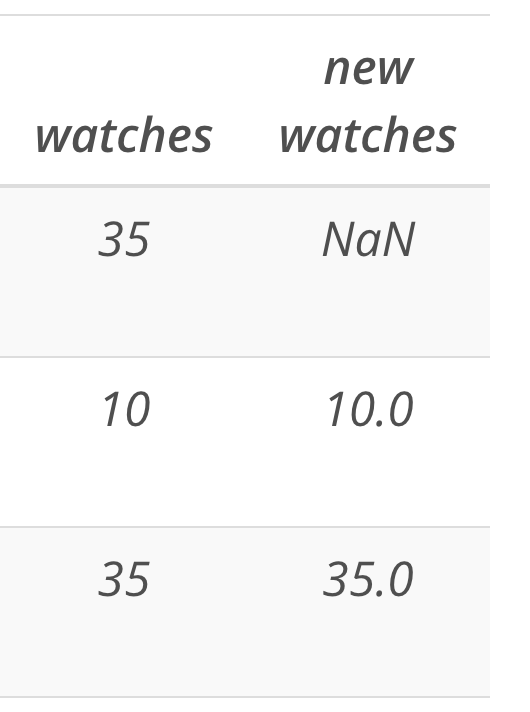
    

    * It is also possible, to insert new columns into the DataFrames anywhere we want. The `dataframe.insert(loc,label,data)` method allows us to insert a new column in the dataframe at location loc, with the given column label, and given data. Let's add new column named shoes right before the suits column. Since suits has numerical index value 4 then we will use this value as loc. Let's see how this works:

        * ```python
            # We insert a new column with label shoes right before the column with numerical index 4
            store_items.insert(4, 'shoes', [8,5,0])

            # we display the modified DataFrame
            store_items
            ```
    
    * Just as we can add rows and columns we can also delete them. To delete rows and columns from our DataFrame we will use the `.pop()` and `.drop()` methods. The `.pop()` method only allows us to delete columns, while the `.drop()` method can be used to delete both rows and columns by use of the axis keyword. Let's see some examples

        * ```python
            # We remove the new watches column
            store_items.pop('new watches')

            # we display the modified DataFrame
            store_items
            ```

        * ```python
            # We remove the watches and shoes columns
            store_items = store_items.drop(['watches', 'shoes'], axis = 1)

            # we display the modified DataFrame
            store_items
            ```
    
    * Sometimes we might need to change the row and column labels. Let's change the bikes column label to hats using the `.rename()` method

        * ```python
            # We change the column label bikes to hats
            store_items = store_items.rename(columns = {'bikes': 'hats'})

            # we display the modified DataFrame
            store_items

            # We change the row label from store 3 to last store
            store_items = store_items.rename(index = {'store 3': 'last store'})

            # we display the modified DataFrame
            store_items
            ```
    * You can also change the index to be one of the columns in the DataFrame.

        * ```python
            # We change the row index to be the data in the pants column
            store_items = store_items.set_index('pants')

            # we display the modified DataFrame
            store_items
            ```
    
    * As mentioned earlier, before we can begin training our learning algorithms with large datasets, we usually need to clean the data first. This means we need to have a method for detecting and correcting errors in our data. While any given dataset can have many types of bad data, such as outliers or incorrect values, the type of bad data we encounter almost always is missing values. As we saw earlier, Pandas assigns `NaN` values to missing data. In this lesson we will learn how to detect and deal with `NaN` values.

    * We will begin by creating a DataFrame with some `NaN` values in it.

        * ```python
            # We create a list of Python dictionaries
            items2 = [{'bikes': 20, 'pants': 30, 'watches': 35, 'shirts': 15, 'shoes':8, 'suits':45},
            {'watches': 10, 'glasses': 50, 'bikes': 15, 'pants':5, 'shirts': 2, 'shoes':5, 'suits':7},
            {'bikes': 20, 'pants': 30, 'watches': 35, 'glasses': 4, 'shoes':10}]

            # We create a DataFrame  and provide the row index
            store_items = pd.DataFrame(items2, index = ['store 1', 'store 2', 'store 3'])

            # We display the DataFrame
            store_items
            ```
    
    * We can clearly see that the DataFrame we created has 3 `NaN` values: one in store 1 and two in store 3. However, in cases where we load very large datasets into a DataFrame, possibly with millions of items, the number of `NaN` values is not easily visualized. For these cases, we can use a combination of methods to count the number of `NaN` values in our data. The following example combines the `.isnull()` and the `sum()` methods to count the number of NaN values in our DataFrame

        * ```python
            # We count the number of NaN values in store_items
            x =  store_items.isnull().sum().sum()

            # We print x
            print('Number of NaN values in our DataFrame:', x)
            ```

    * In the above example, the `.isnull()` method returns a Boolean DataFrame of the same size as `store_items` and indicates with True the elements that have NaN values and with False the elements that are not. Let's see an example:

        * ```python 
            store_items.isnull()
            ```

    * In Pandas, logical True values have numerical value 1 and logical False values have numerical value 0. Therefore, we can count the number of NaN values by counting the number of logical True values. In order to count the total number of logical True values we use the .sum() method twice. We have to use it twice because the first sum returns a Pandas Series with the sums of logical True values along columns, as we see below: ```store_items.isnull().sum()```

    * The second sum will then add up the 1s in the above Pandas Series.

    * Instead of counting the number of NaN values we can also do the opposite, we can count the number of non-NaN values. We can do this by using the `.count()` method as shown below:

        * ```python
            # We print the number of non-NaN values in our DataFrame
            print()
            print('Number of non-NaN values in the columns of our DataFrame:\n', store_items.count())
            ```
    
    * Now that we learned how to know if our dataset has any `NaN` values in it, the next step is to decide what to do with them. In general we have two options, we can either delete or replace the `NaN` values. In the following examples we will show you how to do both.

    * We will start by learning how to eliminate rows or columns from our DataFrame that contain any `NaN` values. The `.dropna(axis)` method eliminates any rows with `NaN` values when `axis = 0` is used and will eliminate any columns with `NaN` values when `axis = 1` is used. Let's see some examples

        * ```python
            # We drop any rows with NaN values
            store_items.dropna(axis = 0)

            # We drop any columns with NaN values
            store_items.dropna(axis = 1)
            ```
    
    * Notice that the `.dropna()` method eliminates (drops) the rows or columns with NaN values out of place. This means that the original DataFrame is not modified. You can always remove the desired rows or columns in place by setting the keyword `inplace = True` inside the `dropna()` function.

    * Now, instead of eliminating `NaN` values, we can replace them with suitable values. We could choose for example to replace all `NaN` values with the value 0. We can do this by using the `.fillna()` method as shown below.

        * ```python
            # We replace all NaN values with 0
            store_items.fillna(0)
            ```
    
    * We can also use the `.fillna()` method to replace NaN values with previous values in the DataFrame, this is known as forward filling. When replacing NaN values with forward filling, we can use previous values taken from columns or rows. The `.fillna(method = 'ffill', axis)` will use the forward filling (ffill) method to replace NaN values using the previous known value along the given axis. Let's see some examples:

        * ```python
            # We replace NaN values with the previous value in the column
            store_items.fillna(method = 'ffill', axis = 0)
            ```
    
    * Notice that the two NaN values in store 3 have been replaced with previous values in their columns. However, notice that the NaN value in store 1 didn't get replaced. That's because there are no previous values in this column, since the NaN value is the first value in that column. However, if we do forward fill using the previous row values, this won't happen. Let's take a look:

        * ```python
            # We replace NaN values with the previous value in the row
            store_items.fillna(method = 'ffill', axis = 1)
            ```
    
    * We see that in this case all the NaN values have been replaced with the previous row values.

    * Similarly, you can choose to replace the NaN values with the values that go after them in the DataFrame, this is known as backward filling. The `.fillna(method = 'backfill', axis)` will use the backward filling (backfill) method to replace NaN values using the next known value along the given axis. Just like with forward filling we can choose to use row or column values. Let's see some examples:

        * ```python
            # We replace NaN values with the next value in the column
            store_items.fillna(method = 'backfill', axis = 0)
            ```
    
    * Notice that the `NaN` value in store 1 has been replaced with the next value in its column. However, notice that the two NaN values in store 3 didn't get replaced. That's because there are no next values in these columns, since these NaN values are the last values in those columns. However, if we do backward fill using the next row values, this won't happen. Let's take a look:

        * ```python
            # We replace NaN values with the next value in the row
            store_items.fillna(method = 'backfill', axis = 1)
            ```
    
    * Notice that the `.fillna()` method replaces (fills) the NaN values out of place. This means that the original DataFrame is not modified. You can always replace the NaN values in place by setting the keyword `inplace = True` inside the `fillna()` function.

    * We can also choose to replace `NaN` values by using different interpolation methods. For example, the `.interpolate(method = 'linear', axis)` method will use linear interpolation to replace `NaN` values using the values along the given axis. Let's see some examples:

        * ```python
            # We replace NaN values by using linear interpolation using column values
            store_items.interpolate(method = 'linear', axis = 0)
            ```

    * ```python
        import pandas as pd
        import numpy as np

        pd.set_option('precision', 1)

        books = pd.Series(data = ['Great Expectations', 'Of Mice and Men', 'Romeo and Juliet', 'The Time Machine', 'Alice in Wonderland' ])
        authors = pd.Series(data = ['Charles Dickens', 'John Steinbeck', 'William Shakespeare', ' H. G. Wells', 'Lewis Carroll' ])
        user_1 = pd.Series(data = [3.2, np.nan ,2.5])
        user_2 = pd.Series(data = [5., 1.3, 4.0, 3.8])
        user_3 = pd.Series(data = [2.0, 2.3, np.nan, 4])
        user_4 = pd.Series(data = [4, 3.5, 4, 5, 4.2])

        dat = {'Book Title' : books,
            'Author' : authors,
            'User 1' : user_1,
            'User 2' : user_2,
            'User 3' : user_3,
            'User 4' : user_4}

        book_ratings = pd.DataFrame(dat)

        print(book_ratings.mean())
        print()

        book_ratings.fillna(book_ratings.mean(), inplace = True)

        print(book_ratings)
        ```
    
    * In machine learning you will most likely use databases from many sources to train your learning algorithms. Pandas allows us to load databases of different formats into DataFrames. One of the most popular data formats used to store databases is csv. CSV stands for Comma Separated Values and offers a simple format to store data. We can load CSV files into Pandas DataFrames using the pd.read_csv() function. Let's load Google stock data into a Pandas DataFrame. The GOOG.csv file contains Google stock data from 8/19/2004 till 10/13/2017 taken from Yahoo Finance.

    * ```python
        import pandas as pd

        # We load Google stock data in a DataFrame
        Google_stock = pd.read_csv('./GOOG.csv')

        # We print some information about Google_stock
        print('Google_stock is of type:', type(Google_stock))
        print('Google_stock has shape:', Google_stock.shape)
        ```

    * We see that we have loaded the GOOG.csv file into a Pandas DataFrame and it consists of 3,313 rows and 7 columns. Now let's look at the stock data

    * We see that it is quite a large dataset and that Pandas has automatically assigned numerical row indices to the DataFrame. Pandas also used the labels that appear in the data in the CSV file to assign the column labels.

    * When dealing with large datasets like this one, it is often useful just to take a look at the first few rows of data instead of the whole dataset. We can take a look at the first 5 rows of data using the `.head()` method, as shown below: ```Google_stock.head()```

    * We can also optionally use `.head(N)` or `.tail(N)` to display the first and last N rows of data, respectively.

    * Let's do a quick check to see whether we have any `NaN` values in our dataset. To do this, we will use the `.isnull()` method followed by the `.any()` method to check whether any of the columns contain `NaN` values.

        * ```python
            Google_stock.isnull().any()
            ```
    
    * We see that we have no NaN values.

    * When dealing with large datasets, it is often useful to get statistical information from them. Pandas provides the `.describe()` method to get descriptive statistics on each column of the DataFrame. Let's see how this works:

        * ```python
            # We get descriptive statistics on our stock data
            Google_stock.describe()
            ```
    
    * If desired, we can apply the .describe() method on a single column as shown below: ```Google_stock['Adj Close'].describe()```

    * Similarly, you can also look at one statistic by using one of the many statistical functions Pandas provides. Let's look at some examples:

        * ```python
            # We print information about our DataFrame  
            print()
            print('Maximum values of each column:\n', Google_stock.max())
            print()
            print('Minimum Close value:', Google_stock['Close'].min())
            print()
            print('Average value of each column:\n', Google_stock.mean())
            ```
    
    * Another important statistical measure is data correlation. Data correlation can tell us, for example, if the data in different columns are correlated. We can use the .corr() method to get the correlation between different columns, as shown below:

        * ```python
            # We display the correlation between columns
            Google_stock.corr()
            ```
    
    * A correlation value of 1 tells us there is a high correlation and a correlation of 0 tells us that the data is not correlated at all.

    * We will end this Introduction to Pandas by taking a look at the `.groupby()` method. The `.groupby()` method allows us to group data in different ways. Let's see how we can group data to get different types of information. For the next examples we are going to load fake data about a fictitious company.

    * We see that the data contains information for the year 1990 through 1992. For each year we see name of the employees, the department they work for, their age, and their annual salary. Now, let's use the `.groupby()` method to get information.

    * Let's calculate how much money the company spent in salaries each year. To do this, we will group the data by Year using the `.groupby()` method and then we will add up the salaries of all the employees by using the `.sum()` method.

        * ```python
            # We display the total amount of money spent in salaries each year
            data.groupby(['Year'])['Salary'].sum()

            # We display the total salary each employee received in all the years they worked for the company
            data.groupby(['Name'])['Salary'].sum()
            ```


### Matplotlib

* **Univariate Visualization**: Visualization of single variables
    * Bar charts for qualitative variables
    * Histograms for quantitative variables

    * What is Tidy Data?

        * In this course, it is expected that your data is organized in some kind of tidy format. In short, a tidy dataset is a tabular dataset where:

            * each variable is a column
            * each observation is a row
            * each type of observational unit is a table
        
        * The first three images below depict a tidy dataset. This tidy dataset is in the field of healthcare and has two tables: one for patients (with their patient ID, name, and age) and one for treatments (with patient ID, what drug that patient is taking, and the dose of that drug).

            * 
            * 
            * 
        
        * The next image depicts the same data but in one representation of a non-tidy format (there are other possible non-tidy representations). The Drug A, Drug B, and Drug C columns should form one 'Drug' column, since this is one variable. The entire table should be separated into two tables: a patients table and a treatments table.

            * 
        
        * While the data provided to you in the course will all be tidy, in practice, you may need to perform tidying work before exploration. You should be comfortable with reshaping your data or perform transformations to split or combine features in your data, resulting in new data columns. This work should be performed in the wrangling stage of the data analysis process, so if you need to know more about these operations, it is recommended that you refer back to the data wrangling content from earlier in the program.

        * This is also not to say that tidy data is the only useful form that data can take. In fact, as you work with a dataset, you might need to summarize it in a non-tidy form in order to generate appropriate visualizations. You'll see one example of this in the bivariate plotting lesson, where categorical counts need to put into a matrix form in order to create a heat map.

    * Bar charts for qualitative variables
        * Quantitative data analysis, which deals with numbers.
        * Qualitative data analysis, which deals with text or pictures.
        * 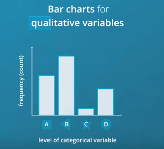
        * 
        * 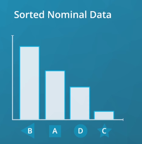
            * Which category is the most common, and how the rest of the categories compare 
        * 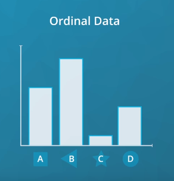
            * It is more important to know if the most common categories are lower or higher in the spectrum, rather than which label is the most frequent 
            * 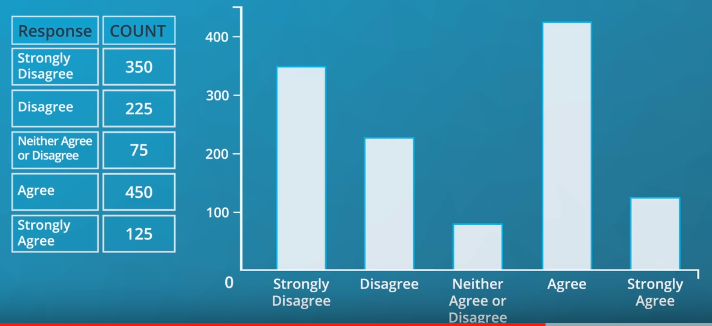