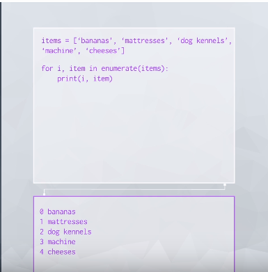
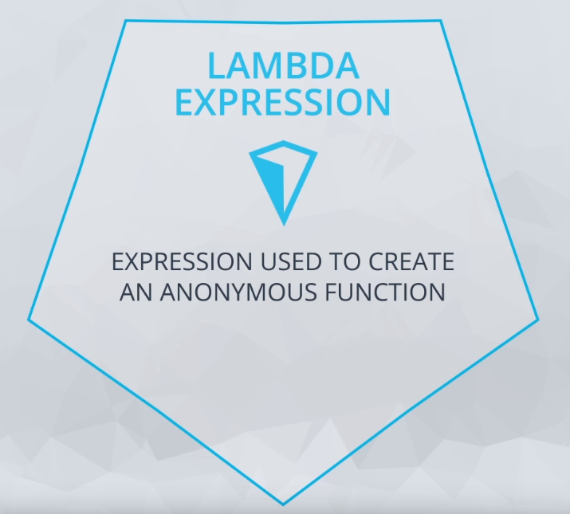

# AI Programming with Python Nanodegree Program

## Introduction to Python

### Lesson 2: Data Types and Operators

* `**`: Exponentiation
    * `3 ** 2`: 3 to the power of 2
* `//`: Integer division
    * `7 // 2 == 3`: It rounds down the answer to an integer
        * `-5 // 2 == -3` and `5 // 2 == 2` 

* 

* Note that this code uses scientific notation to define large numbers. `4.445e8` is equal to `4.445 * 10 ** 8` which is equal to `444500000.0`.

#### Integers and Floats

* Because the float, or approximation, for 0.1 is actually slightly more than 0.1, when we add several of them together we can see the difference between the mathematically correct answer and the one that Python creates.

    * ```python
        >>> print(.1 + .1 + .1 == .3)
        False
        ```

### Lesson 3: Data Structures

#### Slicing a list

* You saw that we can pull more than one value from a list at a time by using slicing. When using slicing, it is important to remember that the `lower` index is `inclusive` and the `upper` index is `exclusive`.

* ```python
    >>> list_of_random_things = [1, 3.4, 'a string', True]
    >>> list_of_random_things[1:2]
    [3.4]
    ```

* will only return 3.4 in a list. Notice this is still different than just indexing a single element, because you get a list back with this indexing. The colon tells us to go from the starting value on the left of the colon up to, but not including, the element on the right.

* If you know that you want to start at the beginning, of the list you can also leave out this value.
    * ```python
        >>> list_of_random_things[:2]
        [1, 3.4]
        ```

* or to return all of the elements to the end of the list, we can leave off a final element.
    * ```python
        >>> list_of_random_things[1:]
        [3.4, 'a string', True]
        ```

#### Mutability and Order

* Mutability is about whether or not we can change an object once it has been created. If an object (like a list or string) can be changed (like a list can), then it is called mutable. However, if an object cannot be changed with creating a completely new object (like strings), then the object is considered immutable.

    * List is mutable and ordered
    * Tuple is immutable and ordered
        * ```(1,2,3,4)```
    * Set is mutable and has no duplicates
    * Dictionary for mutable objects that store mapping of unique keys to values.

* The == operator compares by checking for equality: If these cats were Python objects and we’d compare them with the == operator, we’d get “both cats are equal” as an answer.

* The is operator, however, compares identities: If we compared our cats with the is operator, we’d get “these are two different cats” as an answer.

### Lesson 4: Control Flow

* Zip: 
    * 
    * ```python
        letters = ['a', 'b', 'c']
        nums = [1, 2, 3]

        for letter, num in zip(letters, nums):
            print("{}: {}".format(letter, num))
        ```
    * In addition to zipping two lists together, you can also unzip a list into tuples using an asterisk.
        * ```python
            some_list = [('a', 1), ('b', 2), ('c', 3)]
            letters, nums = zip(*some_list)
            ```
        * ```python
            x_coord = [23, 53, 2, -12, 95, 103, 14, -5]
            y_coord = [677, 233, 405, 433, 905, 376, 432, 445]
            z_coord = [4, 16, -6, -42, 3, -6, 23, -1]
            labels = ["F", "J", "A", "Q", "Y", "B", "W", "X"]

            points = []
            for point in zip(labels, x_coord, y_coord, z_coord):
                points.append("{}: {}, {}, {}".format(*point))

            for point in points:
                print(point)
            ```

* Enumerate
    * 
    * enumerate is a built in function that returns an iterator of tuples containing indices and values of a list. You'll often use this when you want the index along with each element of an iterable in a loop.
        * ```python
            letters = ['a', 'b', 'c', 'd', 'e']
            for i, letter in enumerate(letters):
                print(i, letter)
            ```

* List Comprehensions
    *  
    * ```python
        squares = [x**2 for x in range(9) if x % 2 == 0]
        squares = [x**2 for x in range(9) if x % 2 == 0 else x + 3]
        squares = [x**2 if x % 2 == 0 else x + 3 for x in range(9)]

        names = ["Rick Sanchez", "Morty Smith", "Summer Smith", "Jerry Smith", "Beth Smith"]

        first_names = [name.split(" ")[0].lower() for name in names]# write your list comprehension here
        print(first_names)
        ```

### Lesson 5: Functions

* Lambda Expressions

    * You can use lambda expressions to create anonymous functions. That is, functions that don’t have a name. They are helpful for creating quick functions that aren’t needed later in your code. This can be especially useful for higher order functions, or functions that take in other functions as arguments.

    *  
    * `double = lambda x: x * 2`

* Iterator: An object that represents a stream of data
    * The `yield` key-works is what differentiate a normal object from an iterator object
* Generator: A function that creates an iterator
    * Generators are a lazy way to build iterables. They are useful when the fully realized list would not fit in memory, or when the cost to calculate each list element is high and you want to do it as late as possible. But they can only be iterated over once.

```python
def my_enumerate(iterable, start=0):
    count = start
    for element in iterable:
        yield count, element
        count += 1

for i, lesson in my_enumerate(lessons, 1):
    print("Lesson {}: {}".format(i, lesson))

def chunker(iterable, size):
    """Yield successive chunks from iterable of length size."""
    for i in range(0, len(iterable), size):
        yield iterable[i:i + size]

for chunk in chunker(range(25), 4):
    print(list(chunk))

sq_list = [x**2 for x in range(10)]  # this produces a list of squares

sq_iterator = (x**2 for x in range(10))  # this produces an iterator of squares
```

### Lesson 6: Scripting

* ```python
    names = input("Enter names separated by commas: ").title().split(",")
    assignments = input("Enter assignment counts separated by commas: ").split(",")
    grades = input("Enter grades separated by commas: ").split(",")

    message = "Hi {},\n\nThis is a reminder that you have {} assignments left to \
    submit before you can graduate. You're current grade is {} and can increase \
    to {} if you submit all assignments before the due date.\n\n"

    for name, assignment, grade in zip(names, assignments, grades):
        print(message.format(name, assignment, grade, int(grade) + int(assignment)*2))
    ```

* ```python
    import useful_functions
    useful_functions.add_five([1, 2, 3, 4])

    import useful_functions as uf
    uf.add_five([1, 2, 3, 4])
    ```

* Using a main block

    * To avoid running executable statements in a script when it's imported as a module in another script, include these lines in an if __name__ == "__main__" block. Or alternatively, include them in a function called main() and call this in the if main block.

    * Whenever we run a script like this, Python actually sets a special built-in variable called __name__ for any module. When we run a script, Python recognizes this module as the main program, and sets the __name__ variable for this module to the string "__main__". For any modules that are imported in this script, this built-in __name__ variable is just set to the name of that module. Therefore, the condition if __name__ == "__main__"is just checking whether this module is the main program.

    * Try running `demo.py`

* Techniques for Importing Modules

    * There are other variants of import statements that are useful in different situations.

        * `from module_name import object_name`

        * `from module_name import first_object, second_object`

        * `import module_name as new_name`

        * `from module_name import object_name as new_name`

        * `from module_name import *`
            * **Do not do this**

* Exceptions
    * ```python
        try:
            # some code
        except ZeroDivisionError as e:
        # some code
        print("ZeroDivisionError occurred: {}".format(e))
        ```

### Lesson 7: Intro to Object-Oriented Programming

* ```python
    class Shirt:

    def __init__(self, shirt_color, shirt_size, shirt_style, shirt_price):
        self._price = shirt_price

    def get_price(self):
      return self._price

    def set_price(self, new_price):
      self._price = new_price


    shirt_one = Shirt('yellow', 'M', 'long-sleeve', 15)
    print(shirt_one.get_price())
    shirt_one.set_price(10)
    ```

*  A docstring is a type of comment that describes how a Python module, function, class or method works. Docstrings, therefore, are not unique to object-oriented programming. This section of the course is merely reminding you to use docstrings and to comment your code. It's not just going to help you understand and maintain your code. It will also make you a better job candidate.

* ```python
    class Pants:
    """The Pants class represents an article of clothing sold in a store
    """

    def __init__(self, color, waist_size, length, price):
        """Method for initializing a Pants object

        Args: 
            color (str)
            waist_size (int)
            length (int)
            price (float)

        Attributes:
            color (str): color of a pants object
            waist_size (str): waist size of a pants object
            length (str): length of a pants object
            price (float): price of a pants object
        """

        self.color = color
        self.waist_size = waist_size
        self.length = length
        self.price = price

    def change_price(self, new_price):
        """The change_price method changes the price attribute of a pants object

        Args: 
            new_price (float): the new price of the pants object

        Returns: None

        """
        self.price = new_price

    def discount(self, percentage):
        """The discount method outputs a discounted price of a pants object

        Args:
            percentage (float): a decimal representing the amount to discount

        Returns:
            float: the discounted price
        """
        return self.price * (1 - percentage)
    ```

* Magic methods 
    * `__init__` is one
    * `__add__` and `__repr__` are also examples
    * Those methods let you override and customize default Python behavior
        * `__add__` overrides the behavior of the plus sign
        * `__repr__` when the only code in a line is a variable

### Extra material

* **First-Class Objects**
In Python, functions are first-class objects. This means that functions can be passed around and used as arguments, just like any other object (string, int, float, list, and so on). Consider the following three functions:

* ```python
    def say_hello(name):
        return f"Hello {name}"

    def be_awesome(name):
        return f"Yo {name}, together we are the awesomest!"

    def greet_bob(greeter_func):
        return greeter_func("Bob")
    ```

* **Inner Functions** It’s possible to define functions inside other functions. Such functions are called inner functions. Here’s an example of a function with two inner functions:

* ```python
    def parent():
        print("Printing from the parent() function")

        def first_child():
            print("Printing from the first_child() function")

        def second_child():
            print("Printing from the second_child() function")

        second_child()
        first_child()
    ```

    * Furthermore, the inner functions are not defined until the parent function is called. They are locally scoped to parent(): they only exist inside the parent() function as local variables. Try calling first_child(). You should get an error

* **Simple Decorators** Now that you’ve seen that functions are just like any other object in Python, you’re ready to move on and see the magical beast that is the Python decorator. Let’s start with an example:

* ```python
    def my_decorator(func):
        def wrapper():
            print("Something is happening before the function is called.")
            func()
            print("Something is happening after the function is called.")
        return wrapper

    def say_whee():
        print("Whee!")

    say_whee = my_decorator(say_whee)
    ```

* ```python
    >>> say_whee()
    Something is happening before the function is called.
    Whee!
    Something is happening after the function is called.
    ```
* Put simply: decorators wrap a function, modifying its behavior.

 * Syntactic Sugar!
    * The way you decorated say_whee() above is a little clunky. First of all, you end up typing the name say_whee three times. In addition, the decoration gets a bit hidden away below the definition of the function.
    * Instead, Python allows you to use decorators in a simpler way with the @ symbol, sometimes called the “pie” syntax. The following example does the exact same thing as the first decorator example:

* ```python
    def my_decorator(func):
        def wrapper():
            print("Something is happening before the function is called.")
            func()
            print("Something is happening after the function is called.")
        return wrapper

    @my_decorator
    def say_whee():
        print("Whee!")
    ```

    * Recall that a decorator is just a regular Python function. All the usual tools for easy reusability are available. Let’s move the decorator to its own module that can be used in many other functions.

* **Decorating Functions With Arguments** 

    * ```python
            from decorators import do_twice

            @do_twice
            def greet(name):
                print(f"Hello {name}")
        ```

    * ```python
        def do_twice(func):
        def wrapper_do_twice(*args, **kwargs):
            print(args)
            print(kwargs)
            func(*args, **kwargs)
            func(*args, **kwargs)
        return wrapper_do_twice
        ```

    * There are 2 kinds of arguments in Python, one is positional arguments and other is keyword arguments, the former are specified according to their position and latter are the arguments with keyword which is the name of the argument.   

    * Before looking at the variadic positional/keyword arguments, we’ll talk about the positional arguments and keyword arguments simply.

    * ```python
        # A function that shows the results of running competitions consisting of 2 to 4 runners.
        def save_ranking(first, second, third=None, fourth=None):
            rank = {}
            rank[1], rank[2] = first, second
            rank[3] = third if third is not None else 'Nobody'
            rank[4] = fourth if fourth is not None else 'Nobody'
            print(rank)    

        # Pass the 2 positional arguments
        save_ranking('ming', 'alice')
        # Pass the 2 positional arguments and 1 keyword argument
        save_ranking('alice', 'ming', third='mike')
        # Pass the 2 positional arguments and 2 keyword arguments (But, one of them was passed as like positional argument)
        save_ranking('alice', 'ming', 'mike', fourth='jim')

        ```
    
    * Above function has 2 positional arguments: first, second and 2 keyword arguments: third, fourth. For positional arguments, it is not possible to omit it, and you must pass all positional arguments to the correct location for each number of arguments declared. However, for keyword arguments, you can set a default value of it when declaring a function, and if you omit the argument, the corresponding default value is entered as the value of the argument. That is, the keyword arguments can be omitted.

    * ```python
        def save_ranking(*args, **kwargs):
            print(args)     
            print(kwargs)
        save_ranking('ming', 'alice', 'tom', fourth='wilson', fifth='roy')     # ('ming', 'alice', 'tom')
        # {'fourth': 'wilson', 'fifth': 'roy'}
        ```
    
    * As you can see above, we are passing the arguments which can hold arbitrary numbers of positional or keyword values. The arguments passed as positional are stored in a list called args, and the arguments passed as keyword are stored in a dict called kwargs.

    * ```python
        from functools import reduce

        primes = [2, 3, 5, 7, 11, 13]

        def product(*numbers):
            p = reduce(lambda x, y: x * y, numbers)
            return p 

        product(*primes)
        # 30030

        product(primes)
        # [2, 3, 5, 7, 11, 13]
        ```

    * **For tuple, it could be done exactly same to list, and for dict, just use ** instead of *.**


## Numpy, Pandas, Matplotlib

### Anaconda

* Anaconda is an open source distribution for Python designed for large-scale data. With Anaconda you will be able to simplify package management.

* Welcome to this lesson on using Anaconda to manage packages and environments for use with Python. With Anaconda, it's simple to install the packages you'll often use in data science work. You'll also use it to create virtual environments that make working on multiple projects much less mind-twisting. Anaconda has simplified my workflow and solved a lot of issues I had dealing with packages and multiple Python versions.

* Anaconda is actually a distribution of software that comes with conda, Python, and over 150 scientific packages and their dependencies. The application conda is a package and environment manager. Anaconda is a fairly large download (~500 MB) because it comes with the most common data science packages in Python. If you don't need all the packages or need to conserve bandwidth or storage space, there is also Miniconda, a smaller distribution that includes only conda and Python. Miniconda can do everything Anaconda does, but doesn't have the preinstalled packages. You can still install any of the available packages with conda, it just doesn't come with them, so either Anaconda or Miniconda are fine for this course.

* Package managers are used to install libraries and other software on your computer. You’re probably already familiar with pip, it’s the default package manager for Python libraries. Conda is similar to pip except that the available packages are focused around data science while pip is for general use. However, conda is not Python specific like pip is, it can also install non-Python packages. It is a package manager for any software stack. That being said, not all Python libraries are available from the Anaconda distribution and conda. You can (and will) still use pip alongside conda to install packages.

* You can install multiple packages at the same time. Something like `conda install numpy scipy pandas` will install all those packages simultaneously. It's also possible to specify which version of a package you want by adding the version number such as `conda install numpy=1.10`.

* Most of the commands are pretty intuitive. To uninstall, use `conda remove package_name`. To update a package `conda update package_name`. If you want to update all packages in an environment, which is often useful, use `conda update --all`. And finally, to list installed packages, it's conda list which you've seen before.

### Managing Anaconda Environments 

* As I mentioned before, conda can be used to create environments to isolate your projects. To create an environment, use `conda create -n env_name list of packages` in your terminal. Here -n env_name sets the name of your environment (-n for name) and list of packages is the list of packages you want installed in the environment. For example, to create an environment named my_env and install numpy in it, type `conda create -n my_env numpy`.

* When creating an environment, you can specify which version of Python to install in the environment. This is useful when you're working with code in both Python 2.x and Python 3.x. To create an environment with a specific Python version, do something like `conda create -n py3 python=3` or `conda create -n py2 python=2`. I actually have both of these environments on my personal computer. I use them as general environments not tied to any specific project, but rather for general work with each Python version easily accessible. These commands will install the most recent version of Python 3 and 2, respectively. To install a specific version, use `conda create -n py python=3.3` for Python 3.3.

* `conda activate my_env` to enter it.

    * When you're in the environment, you'll see the environment name in the terminal prompt. Something like `(my_env) ~ $`. The environment has only a few packages installed by default, plus the ones you installed when creating it. You can check this out with `conda list`. Installing packages in the environment is the same as before: `conda install package_name`. Only this time, the specific packages you install will only be available when you're in the environment. To leave the environment, type `source deactivate` (on OSX/Linux). On Windows, use `deactivate`.

### Saving Environments 

* A really useful feature is sharing environments so others can install all the packages used in your code, with the correct versions. You can save the packages to a YAML file with `conda env export > environment.yaml`. The first part `conda env` export writes out all the packages in the environment, including the Python version.

* To create an environment from an environment file use `conda env create -f environment.yaml`. This will create a new environment with the same name listed in environment.yaml.

* **Listing environments**

    * If you forget what your environments are named (happens to me sometimes), use `conda env list` to list out all the environments you've created. You should see a list of environments, there will be an asterisk next to the environment you're currently in. The default environment, the environment used when you aren't in one, is called root.

* **Removing environments**

    * If there are environments you don't use anymore, `conda env remove -n env_name` will remove the specified environment (here, named env_name).

## Best practices - Environments 

* One thing that’s helped me tremendously is having separate environments for Python 2 and Python 3. I used `conda create -n py2 python=2` and `conda create -n py3 python=3` to create two separate environments, py2 and py3. Now I have a general use environment for each Python version. In each of those environments, I've installed most of the standard data science packages (numpy, scipy, pandas, etc.). Remember that when you set up an environment initially, you'll only start with the standard packages and whatever packages you specify in your conda create statement.

* I’ve also found it useful to create environments for each project I’m working on. It works great for non-data related projects too like web apps with Flask. For example, I have an environment for my personal blog using Pelican.

* **Sharing Environments**

    * When sharing your code on GitHub, it's good practice to make an environment file and include it in the repository. This will make it easier for people to install all the dependencies for your code. I also usually include a pip `requirements.txt` file using `pip freeze (learn more here) for people not using conda.

### Jupyter notebooks

* Welcome to this lesson on using Jupyter notebooks. The notebook is a web application that allows you to combine explanatory text, math equations, code, and visualizations all in one easily sharable document.

* Notebooks have quickly become an essential tool when working with data. You'll find them being used for data cleaning and exploration, visualization, machine learning, and big data analysis.
